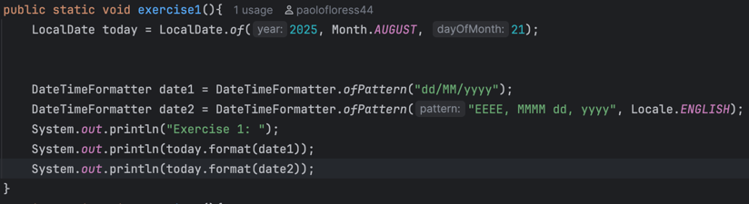

# Paolo Miguel D. Flores
## Hands-on Lab: Working with Java's Date and Time API

### Exercise 1: LocalDate and DateTimeFormatter

---

### Exercise 2: LocalTime and DateTimeFormatter

**Prediction**: 
Default format: 16:45:30 
24-hour format: 16:45:30 
12-hour format with AM/PM: 4:45:30 PM

**Observation**: 
Default format: 16:45:30 
24-hour format: 16:45:30 
12-hour format with AM/PM: 04:45:30 PM

---

### Exercise 3: LocalDateTime and DateTimeFormatter

**Prediction**: 
Default format: 2025-11-27 19:00:00 
Custom format: November 27, 2025 at 07:00PM

**Observation**: 
Default format: 2025-11-27T19:00 
Custom format: November 27, 2025 at 07:00 PM

---

### Exercise 4: The Immutability of Date-Time Objects

**Prediction**: 
Start date after trying to modify it: 2025-09-01 
The original start data is still: 2025-09-01 
The new end date is: 2025-09-11

**Observation**: 
Start date after trying to modify it: 2025-09-01 
The original start data is still: 2025-09-01 
The new end date is: 2025-09-11

---

### Exercise 5: Adding and Subtracting Time (plus and minus)

**Prediction**: 
Base time: 2025-10-15 10:30 
Future time: 2026-12-15 15:30 
Past time: 2025-09-16 10:30

**Observation**: 
Base time:   2025-10-15 10:30 
Future time: 2026-12-15 15:30 
Past time:   2025-09-21 10:30

---

### Exercise 6: Period - Measuring a Span of Time

**Prediction**: 
The period between the two dates is: 2 years, 4 months, and 5 days.

**Observation**: 
The period between the two dates is: 2 years, 4 months, and 5 days.

